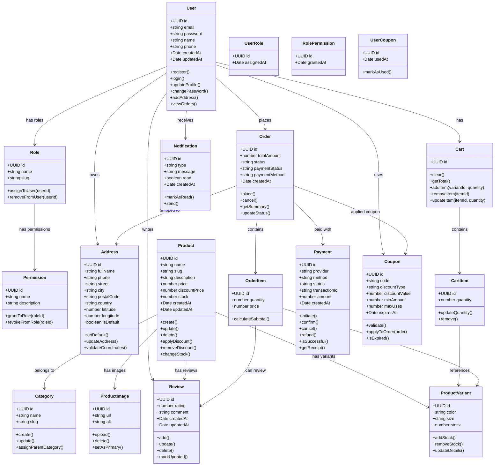

# 🚀 NestJS - Estructura Base Profesional

[](https://nestjs.com/)
[](https://www.typescriptlang.org/)
[](https://typeorm.io/)
[](https://jwt.io/)
[](LICENSE)

Estructura base profesional para proyectos NestJS con arquitectura modular, siguiendo las mejores prácticas para aplicaciones empresariales escalables y mantenibles.

La estructura está inspirada en el artículo [Best Way to Structure Your Directory/Code (NestJS)](https://medium.com/the-crowdlinker-chronicle/best-way-to-structure-your-directory-code-nestjs-a06c7a641401).

<p align="center">
  
</p>

## 📋 Características

- ✅ **Arquitectura hexagonal** con clara separación de responsabilidades
- ✅ **Sistema de autenticación** completo con JWT y refresh tokens
- ✅ **Control de acceso** basado en roles (RBAC) con permisos granulares
- ✅ **Gestión de usuarios** con diferentes roles y permisos
- ✅ **Base de datos** con TypeORM configurado para múltiples proveedores
- ✅ **Migraciones automáticas** para gestión de esquema de BD
- ✅ **Seeders** para datos iniciales y pruebas
- ✅ **Validación** avanzada con class-validator y DTOs
- ✅ **Serialización** de respuestas con class-transformer
- ✅ **Interceptores** para transformación y caché de respuestas
- ✅ **Gestión de errores** centralizada y consistente
- ✅ **Paginación** de resultados en endpoints GET
- ✅ **Búsqueda** avanzada con múltiples campos
- ✅ **CORS configurado** para permitir solicitudes cruzadas
- 🚧 **Testing** unitario y de integración (Planificado)
- ✅ **Documentación** detallada de cada módulo y componente
- ✅ **Sistema de roles** con superadmin, admin, manager y user
- ✅ **Asignación de permisos** a roles y usuarios
- ✅ **Decoradores** personalizados para control de acceso

## 🔧 Requisitos previos

- **Node.js** v14.x o superior
- **npm** v6.x o superior (o **yarn**)
- **Base de datos** (MySQL, PostgreSQL, SQLite, etc.)
- **Git** para control de versiones

## 🚀 Instalación

```bash
# Clonar el repositorio
git clone https://github.com/marcodavidd020/Clothing-Ecommerce-Backend.git
cd nestjs-base-structure

# Instalar dependencias
npm install

# Configurar variables de entorno
cp .env.example .env
# Edita .env con tus configuraciones

# Ejecutar migraciones
npm run migration:run

# Poblar datos iniciales
npm run seed:run

# Iniciar en modo desarrollo
npm run start:dev
```

## 👥 Usuarios por defecto

El sistema incluye los siguientes usuarios predefinidos:

| Usuario | Email | Rol | Descripción |
|---------|-------|-----|------------|
| **Superadmin** | superadmin@example.com | superadmin, user | Acceso completo a todo el sistema |
| **Admin** | admin@example.com | admin, user | Acceso administrativo con restricciones |
| **Usuario Regular** | marco@gmail.com | user, manager | Usuario básico con permisos de manager |

## 🔐 Sistema de Roles y Permisos

El proyecto implementa un sistema avanzado de roles y permisos:

### Roles predefinidos
- **superadmin**: Control total del sistema
- **admin**: Administración general con algunas restricciones
- **manager**: Gestión de recursos específicos
- **user**: Acceso básico al sistema

### Permisos
Los permisos se organizan por módulo y acción, por ejemplo:
- `users.view`: Ver usuarios
- `users.create`: Crear usuarios
- `roles.assign`: Asignar roles

### Asignación de permisos
Los permisos pueden asignarse a roles, y los roles a usuarios, permitiendo un control de acceso granular.

## 🏗️ Estructura del proyecto

```
src/
├── app.module.ts            # Módulo principal de la aplicación
├── main.ts                  # Punto de entrada
├── authentication/          # Sistema de autenticación completo
│   ├── auth.controller.ts   # Endpoints de autenticación
│   ├── auth.service.ts      # Servicios de autenticación
│   ├── jwt.strategy.ts      # Estrategia de validación de tokens
│   └── interfaces/          # Tipos e interfaces
├── common/                  # Componentes compartidos reutilizables
│   ├── constants/           # Constantes globales y enumeraciones
│   ├── decorators/          # Decoradores personalizados (permisos, etc.)
│   ├── exceptions/          # Manejo de excepciones
│   ├── guards/              # Guards de seguridad (JWT, Permisos)
│   ├── helpers/             # Funciones auxiliares
│   ├── interceptors/        # Interceptores
│   ├── pipes/               # Pipes de validación
│   └── serializers/         # Transformadores de respuesta
├── config/                  # Configuraciones por entorno
│   ├── database/            # Configuración de bases de datos
│   ├── app/                 # Configuración de la aplicación
│   └── auth/                # Configuración de autenticación
├── database/                # Gestión de base de datos
│   ├── migrations/          # Migraciones de esquema
│   ├── seeders/             # Seeders para datos iniciales
│   │   ├── users/           # Seeders de usuarios y roles de usuario
│   │   ├── roles/           # Seeders de roles y permisos
│   │   ├── permissions/     # Seeders de permisos
│   │   └── addresses/       # Seeders de direcciones
│   └── factories/           # Factories para generación de datos
├── models/                  # Modelos y dominio de la aplicación
│   ├── common/              # Base común para modelos
│   ├── users/               # Módulo de usuarios
│   ├── roles/               # Módulo de roles
│   ├── permissions/         # Módulo de permisos
│   └── addresses/           # Módulo de direcciones
├── providers/               # Proveedores de servicios externos
│   ├── database/            # Proveedores de bases de datos
│   └── cache/               # Proveedores de caché
└── utils/                   # Utilidades y herramientas
```

## 📚 Documentación

### Documentación detallada del proyecto

La documentación completa está disponible a través de Compodoc:

```bash
# Generar documentación
npm run compodoc:gen

# Servir documentación en http://localhost:8080
npm run compodoc:serve
```

**La documentación generada y desplegada en Vercel se puede visualizar en: [https://clothing-ecommerce-backend-j5yh-kxreprd6z.vercel.app/](https://clothing-ecommerce-backend-j5yh-kxreprd6z.vercel.app/)**

La documentación incluye:

- Arquitectura y estructura del sistema
- Descripción detallada de módulos y componentes
- Diagramas de dependencias y relaciones
- Guías de desarrollo y flujos comunes
- Referencia de API

### Archivos de documentación

Los archivos fuente de la documentación están disponibles en el directorio `documentation/`:

- [📝 Introducción y Descripción General](documentation/index.md)
- [🏛️ Arquitectura del Sistema](documentation/arquitectura.md)
- [🧩 Módulos del Sistema](documentation/modulos.md)
- [⚙️ Componentes](documentation/componentes/)
- [📋 Guías de Usuario](documentation/guias/)
- [📈 Flujos Comunes](documentation/guias/flujos-comunes.md)
- [📊 Prácticas Recomendadas](documentation/guias/practicas-recomendadas.md)

## 🛣️ Roadmap de Módulos de Ecommerce

Los siguientes módulos están planificados para completar la plataforma de ecommerce:

### Módulo de Productos
- CRUD completo para productos
- Categorización y etiquetado
- Gestión de variantes (tallas, colores, etc.)
- Sistema de búsqueda avanzado
- Gestión de inventario

### Módulo de Carrito
- Agregar/remover productos
- Actualizar cantidades
- Aplicar cupones y descuentos
- Persistencia del carrito

### Módulo de Pedidos
- Proceso de checkout completo
- Seguimiento de estado del pedido
- Historial de pedidos
- Facturación
- Gestión de devoluciones

### Módulo de Pagos
- Integración con múltiples pasarelas
- Procesamiento de pagos con tarjeta
- Reembolsos y devoluciones
- Registro de transacciones

### Módulo de Envíos
- Integración con proveedores logísticos
- Cálculo de costes de envío
- Seguimiento de paquetes

Para más detalles sobre los módulos planificados, consulte la [documentación de ecommerce](documentation/modulos-planificados/ecommerce.md).

## 💻 Comandos principales

| Comando | Descripción |
|---------|-------------|
| `npm run start:dev` | Inicia la aplicación en modo desarrollo con recarga automática |
| `npm run build` | Compila la aplicación para producción |
| `npm run start:prod` | Ejecuta la aplicación en modo producción |
| `npm run lint` | Verifica la calidad del código |
| `npm run test` | Ejecuta pruebas unitarias |
| `npm run test:e2e` | Ejecuta pruebas de integración |
| `npm run migration:generate` | Genera migraciones basadas en cambios de entidades |
| `npm run migration:run` | Ejecuta migraciones pendientes |
| `npm run migration:revert` | Revierte la última migración |
| `npm run seed:run` | Ejecuta seeders para datos iniciales |

## 🔍 Ejemplos de uso

### Autenticación de usuarios

```typescript
// POST /auth/login
const credentials = {
  email: 'usuario@ejemplo.com',
  password: 'contraseña123'
};

// Respuesta:
{
  "success": true,
  "message": "Login exitoso",
  "data": {
    "accessToken": "eyJhbGciOiJIUzI1NiIsInR5cCI6IkpXVCJ9...",
    "refreshToken": "eyJhbGciOiJIUzI1NiIsInR5cCI6IkpXVCJ9...",
    "expiresIn": 3600,
    "tokenType": "Bearer"
  },
  "timestamp": "2023-10-27T12:00:00.000Z"
}
```

## 🏗️ System Architecture



## 🚀 Deployment

### Vercel Deployment (Recommended)

#### 1. Prepare your repository
```bash
# Ensure your code is committed and pushed to GitHub
git add .
git commit -m "feat: prepare for Vercel deployment"
git push origin main
```

#### 2. Deploy to Vercel

1. **Connect to Vercel**: Go to [vercel.com](https://vercel.com) and import your GitHub repository
2. **Configure Environment Variables**: In your Vercel dashboard, add these environment variables:

```bash
NODE_ENV=production
API_PREFIX=api
DB_HOST=your-database-host
DB_PORT=5432
DB_USERNAME=your-username
DB_PASSWORD=your-password
DB_NAME=your-database-name
DB_SSL=true
JWT_SECRET=your-super-secret-jwt-key
JWT_EXPIRES_IN=7d
CORS_ORIGIN=*
SWAGGER_ENABLED=true
```

3. **Deploy**: Vercel will automatically detect the `vercel-build` script and deploy your API

#### 3. Access your API
- **API Base URL**: `https://your-app.vercel.app/api`
- **Swagger Documentation**: `https://your-app.vercel.app/api` (Swagger UI)
- **Health Check**: `https://your-app.vercel.app/api/health`

### Docker Production

```bash
# Build and run production containers
npm run docker:prod

# Check logs
docker-compose -f docker-compose.prod.yml logs -f

# Stop production containers
docker-compose -f docker-compose.prod.yml down
```

### Manual Deployment

```bash
# Build the application
npm run build

# Run migrations
npm run migration:run

# Start production server
npm run start:prod
```

## 🔧 Troubleshooting

### Common Vercel Issues

1. **404 Error**: Make sure your `vercel.json` routes are correctly configured
2. **Build Failures**: Check that all dependencies are listed in `package.json`
3. **Environment Variables**: Ensure all required env vars are set in Vercel dashboard
4. **Database Connection**: Use SSL-enabled database URLs for production

### API Testing

```bash
# Test API health
curl https://your-app.vercel.app/api/health

# Test Swagger
curl https://your-app.vercel.app/api

# Test authentication
curl -X POST https://your-app.vercel.app/api/auth/login \
  -H "Content-Type: application/json" \
  -d '{"email":"test@example.com","password":"password"}'
```